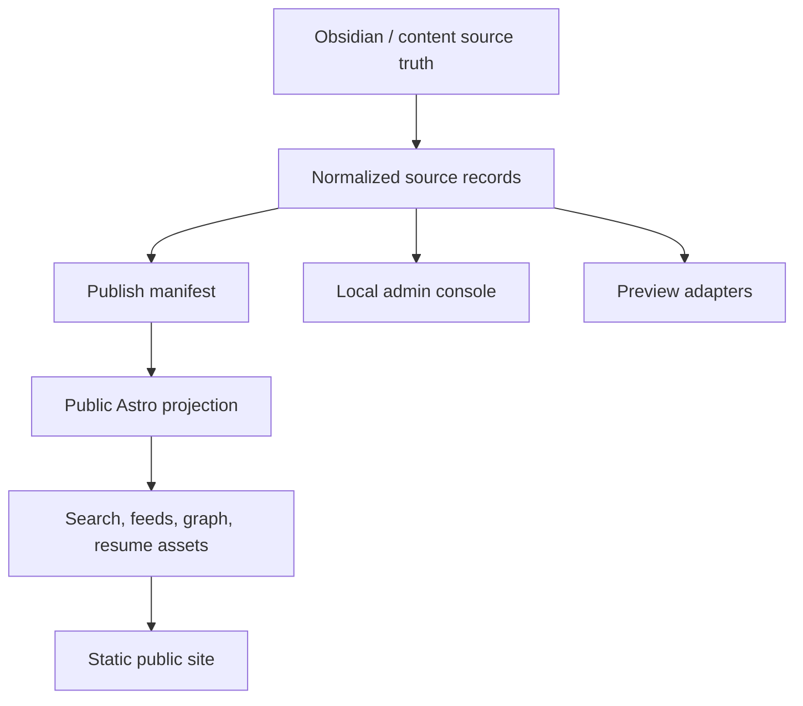

# Architecture

The publish manifest is the privacy boundary. Local admin tooling may inspect source files and private evidence; public pages consume only approved generated assets.

External writes are outside the default architecture and require L4 approval.
